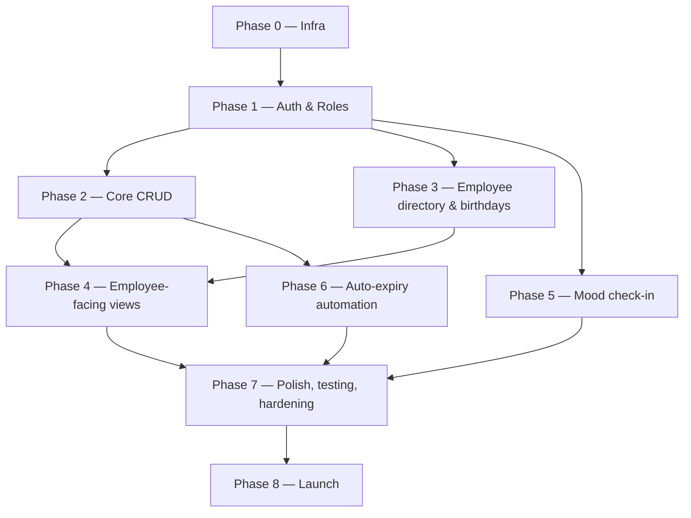

# Implementation Plan

Based on [project-scope.md](./project-scope.md) and [tech-stack.md](./tech-stack.md).

## Dependency overview

Three tracks can run in parallel once Phase 1 ships:

- **Phase 5** only needs a logged-in employee identity (to enforce "one submission per day"), so a second engineer can build it alongside Phases 2–4.
- **Phase 3** only hard-depends on Phase 1. It reuses the CRUD pattern established in Phase 2, but that is a convention dependency, not a technical one — once the pattern exists, Phase 3 can proceed alongside the rest of Phase 2.
- **Phase 6** only needs Phase 2's end-date/status fields to exist. It does **not** depend on Phase 4, so auto-expiry can be built as soon as the Phase 2 schema lands.

Within Phase 2 and Phase 4, each entity (announcements / events / blogs / resources / quick links) is independent of the others — they can be split across engineers and built in parallel once the shared pattern (schema → API → admin UI → public view) is proven on the first entity.

---

## Phase 0 — Project Setup & Infrastructure

No dependencies. Must finish before any other phase starts.

1. Set up monorepo structure (`client/` React, `server/` Express)
2. Configure TypeScript, oxlint, and Prettier for both client and server
3. Choose and configure the test framework (unit/integration runner + E2E tool) — the pipeline's `test` step and all of Phase 7 depend on this existing
4. Define the environment set (`dev`, `production`, and whether a staging tier is needed)
5. Provision Azure resources per environment: App Service (frontend + backend), Azure Database for PostgreSQL, Blob Storage container
6. Set up environment config/secrets management (Azure App Service configuration / Key Vault)
7. Enable application-level logging and monitoring (e.g. Application Insights) — Phase 6.2 covers only the scheduled job, not the app
8. Configure backup and retention policy for PostgreSQL and Blob Storage
9. Choose the CI/CD platform (GitHub Actions vs. Azure DevOps Pipelines) and set up the pipeline (build, lint, test, deploy to Azure)
10. Register app with Zoho for SSO (OAuth client ID/secret). Register for Zoho Calendar API access **only if** the Add-to-Calendar decision resolves to the API rather than a deep link (see Phase 4.3)
11. Choose and configure migrations tool (Prisma)
12. Define initial database schema: `users`, `roles` — this is a hard dependency for Phase 1

**Exit criteria:** empty client/server apps deploy successfully through CI/CD to the Azure dev environment; the pipeline's lint and test steps run and gate the build; migrations run against the provisioned database.

---

## Phase 1 — Authentication & Roles

**Depends on:** Phase 0 (Azure resources, `users`/`roles` schema, Zoho OAuth credentials).
**Blocks:** Phase 2, Phase 3, Phase 5 (any endpoint needing a logged-in user). Phase 4 and Phase 6 inherit this transitively.

1. Implement Zoho SSO login flow (OAuth2 redirect → callback → token exchange)
2. Enforce the organization restriction: reject any authenticated identity outside the organization's Zoho domain/org ID. Zoho SSO on its own authenticates _any_ Zoho account, so this check — not the login flow — is the app's outer security boundary
3. Create session handling on the backend (resolve the session vs. JWT decision first — see [tech-stack.md](./tech-stack.md))
4. Implement `User` / `Admin` role model + middleware for role-based route protection (single reusable `requireRole()` middleware)
5. Build basic authenticated shell (logged-in layout, logout)
6. Seed initial Admin account

**Exit criteria:** a user can log in via Zoho SSO, land on an authenticated shell, and log out; an account outside the organization is rejected at the callback; a protected test route correctly rejects the wrong role.

---

## Phase 2 — Core Data Models & Admin CRUD

**Depends on:** Phase 1 (role middleware).
**Blocks:** Phase 4 (reads this data), Phase 6 (reads the end-date/status fields added here). Phase 3 reuses this phase's CRUD pattern but is not technically blocked by it.
**Internal parallelism:** announcements, events, blogs, resources, and quick links are independent of each other. Build the full vertical slice (schema → API → admin UI) for **announcements first** as the reference implementation, then parallelize the rest across engineers.

1. Design and migrate schema for: announcements, events, blogs, resources, quick links
   - Announcements, events, and blogs get an end-date field — these are the three entities Phase 6 auto-expires
   - All five get a manual status field (e.g. `Archived`) to support active/inactive filtering
2. Backend CRUD API endpoints per entity, create/edit/delete gated by `requireRole(['Admin'])`
3. Admin UI: list/create/edit/delete screens per entity
4. Admin user management: list users, grant/revoke the Admin role, and deactivate leavers — this satisfies the "admin-only user management" line in [project-scope.md](./project-scope.md), which no other phase covers. Reuses this phase's admin UI pattern against the `users`/`roles` tables from Phase 0.12

**Exit criteria:** Admin can create, edit, delete, and archive each of the five entities through the admin UI, and can change another user's role; User role is correctly blocked from all mutation endpoints.

---

## Phase 3 — Employee Directory & Birthdays

**Depends on:** Phase 1 (role middleware). It reuses the CRUD pattern established in Phase 2, but that is a convention dependency rather than a technical one — once the pattern exists, this phase can run alongside the rest of Phase 2.
**Blocks:** Phase 4 (birthday widget reads this data).

1. Build employee record CRUD, gated by `requireRole(['Admin'])` — same permission level as Phase 2 entities
2. Manual data entry only (confirmed — no external HR system integration)
3. Implement "upcoming birthdays" query (next 30 days) and expose as an API endpoint

**Exit criteria:** Admin can manage employee records; birthdays endpoint returns the correct next-30-days set.

---

## Phase 4 — Employee-Facing Views

**Depends on:** Phase 2 (announcements/events/blogs/resources/links APIs), Phase 3 (birthdays API).
**Note:** frontend work on this phase can start **before** Phase 2/3 backends are fully done, as long as the API response shape for each entity is agreed upfront (contract-first) — frontend builds against a mock, backend swaps in later with no interface change.
**Internal parallelism:** each list/detail view is independent of the others.

1. Home/dashboard page assembling: active announcements, active events, upcoming birthdays, quick links, resources
2. Announcements list/detail view
3. Events list/detail view with **Add to Calendar** button — resolve the deep link vs. Zoho Calendar API decision before starting this item specifically. Note that [project-scope.md](./project-scope.md) describes the button as _redirecting_ to Zoho Calendar, which points to a deep link; confirm this before Phase 0.10 registers for Calendar API access
4. Blogs list/detail view
5. Resources list view (file download from Blob Storage)
6. Quick links list view

**Exit criteria:** a logged-in User sees only active announcements/events/blogs, can download resources, click quick links, and successfully add an event to their Zoho Calendar.

---

## Phase 5 — Mood Check-In

**Depends on:** Phase 1 only (needs an authenticated employee identity). Independent of Phase 2/3/4 — can be built in parallel by a separate engineer/track once Phase 1 ships.
**Confirmed constraint:** submissions are anonymous/aggregate only — never linked to an identifiable employee, including for Admin. Enforce this at the schema level (do not store a user↔submission foreign key in a queryable form; e.g. hash+discard the identity after the one-per-day check, or use a separate write-once "already submitted today" record disjoint from the mood value table).

1. Backend: daily mood submission endpoint (emoji-based), enforce one submission per employee per day without persisting a queryable identity-to-submission link
2. Aggregate endpoint: org-wide mood trend (daily/weekly emoji distribution)
3. Frontend: emoji check-in widget on dashboard
4. Frontend: aggregate mood trend view, visible to Admin only

**Exit criteria:** an employee can submit one mood per day; a second same-day submission is rejected; Admin can view aggregate trends only, with no path to any individual's submission (verify this explicitly in Phase 7's access-control tests).

---

## Phase 6 — Automation & Scheduled Jobs

**Depends on:** Phase 2 (end-date/status fields must exist on announcements/events/blogs). Does **not** depend on Phase 4 — this can start as soon as the Phase 2 schema lands.

1. Build Azure Function (timer trigger) for auto-expiry: flip announcements/events/blogs out of "active" once end date passes
2. Add logging/monitoring for the scheduled job

**Exit criteria:** an item with a past end-date is automatically archived and disappears from Phase 4's public views without manual intervention.

---

## Phase 7 — Polish, Testing & Hardening

**Depends on:** Phases 2–6 functionally complete.

1. Responsive/mobile layout pass across all views
2. Input validation and error handling across API endpoints
3. Access control tests: role boundaries generally, plus explicit verification that no individual mood submission is ever retrievable by any role
4. End-to-end tests for critical flows: login, add announcement, add-to-calendar, mood check-in
5. File upload size/type validation for resources
6. Security review (auth flows, organization-restriction enforcement, file upload handling, SQL injection/XSS checks)
7. Enable dependency and secret scanning in the CI pipeline

**Exit criteria:** test suite green; security review sign-off; manual pass on mobile viewport for all employee-facing views.

---

## Phase 8 — Launch

**Depends on:** Phase 7.

1. Final UAT with a pilot group of employees
2. Production Azure environment cutover
3. Rollout announcement and onboarding doc for employees
4. Monitor error logs/usage post-launch
